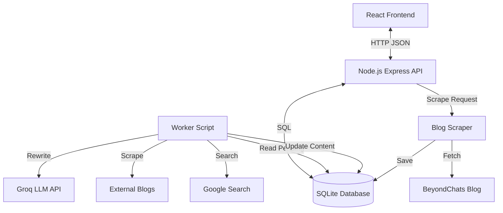

# BeyondChats AI Studio

BeyondChats AI Content Intelligence Platform.

## Project Structure
- **server**: Node.js + Express API + Background Worker.
- **client**: React + Vite Application.

## Prerequisites
- Node.js (v16+)
- OpenAI API Key or Groq API Key (for Phase 2 LLM features)

## Setup

### 1. Server & Backend
1. Navigate to `server` directory:
   ```bash
   cd server
   ```
2. Install dependencies:
   ```bash
   npm install
   ```
3. Create `.env` file (optional, for LLM):
   ```
   GROQ_API_KEY=your_key_here
   # or OPENAI_API_KEY=your_key_here (if code modified)
   ```
4. Start the server:
   ```bash
   node server.js
   ```
   Server runs on `http://localhost:3000`.

### 2. Client (Frontend)
1. Navigate to `client` directory:
   ```bash
   cd client
   ```
2. Install dependencies:
   ```bash
   npm install
   ```
3. Start the dev server:
   ```bash
   npm run dev
   ```
   Client runs on `http://localhost:5173`.

## Features
- **Phase 1**: Scrapes 5 oldest articles from BeyondChats blogs and serves them via API.
- **Phase 2**: Worker script searches Google for related content, scrapes top 2 results, and uses LLM (Groq) to rewrite the article with citations.
- **Phase 3**: Responsive React UI to view original and enhanced articles.

## API Endpoints
- `GET /api/articles` - List all articles.
- `GET /api/articles/:id` - Get details of an article.
- `POST /api/articles/scrape` - Trigger scraping of BeyondChats blog.

## Deployment Guide

To satisfy the "Live Link" requirement, you can deploy this project using free services:

### 1. Backend (Server) - Render / Railway
1.  Create a web service on [Render](https://render.com) or [Railway](https://railway.app).
2.  Connect your GitHub repo.
3.  Set **Root Directory** to `server`.
4.  Set **Build Command** to `npm install`.
5.  Set **Start Command** to `node server.js`.
6.  Add Environment Variables: 
    - `GROQ_API_KEY`: Your key.
    - `PORT`: (Usually auto-configured by the host).
7.  **Get the deployed URL** (e.g., `https://my-backend.onrender.com`).

### 2. Frontend (Client) - Vercel
1.  Push this repository to GitHub.
2.  Go to [Vercel](https://vercel.com) and "Add New Project".
3.  Import your repository.
4.  Set **Root Directory** to `client`.
5.  **Important**: Set Environment Variables:
    - `VITE_API_URL`: The URL of your deployed backend (e.g., `https://my-backend.onrender.com`).
6.  Deploy.

## Submission Details
-   **GitHub Repo**: Ensure this folder is initialized as a git repo (`git init`) and pushed to a public GitHub repository.
-   **Live Link**: https://beyondchatszehel.vercel.app/


## Architecture Diagram



## Database Schema
- **Article Table**
    - `id`, `title`, `limit`, `content` (Original)
    - `updated_content` (LLM Generated)
    - `status` (PENDING/PROCESSED)
    - `citations` (JSON)


